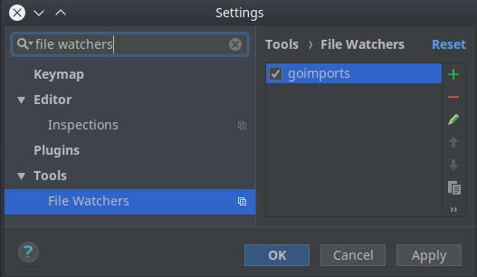

[](https://travis-ci.org/lbryio/lbry.go)
# LBRY in Golang

lbry.go is a set of tools and projects implemented in Golang. See each subfolder for more details

## Installation

No installation required for lbry.go

## Usage

See individual subfolders for usage instructions

## Running from Source

### Go

Make sure you have Go 1.10.1+

- Ubuntu: https://launchpad.net/~longsleep/+archive/ubuntu/golang-backports or https://github.com/golang/go/wiki/Ubuntu
- OSX: `brew install go`


### Lbrycrd

_not strictly necessary, but recommended_

- Install lbrycrdd (https://github.com/lbryio/lbrycrd/releases)
- Ensure `~/.lbrycrd/lbrycrd.conf` file exists with username and password. 
  If you don't have one, run: 

  ```
  mkdir -p ~/.lbrycrd
  echo -e "rpcuser=lbryrpc\nrpcpassword=$(env LC_CTYPE=C LC_ALL=C tr -dc A-Za-z0-9 < /dev/urandom | head -c 16 | xargs)" > ~/.lbrycrd/lbrycrd.conf
  ```

- Run `./lbrycrdd -server -daemon -txindex`. If you get an error about indexing, add the `-reindex` flag for one run. You will only need to
  reindex once.
  
### building lbry.go
clone the repository
```
go get -u github.com/lbryio/lbry.go
cd "$(go env GOPATH)/src/github.com/lbryio/lbry.go"
```
run `make` from the root directory to build the binary

## Contributing

Contributions to this project are welcome, encouraged, and compensated. For more details, see [lbry.io/faq/contributing](https://lbry.io/faq/contributing)

 GO strictly enforces a correct syntax therefore you might need to run `go fmt` from inside the each working directory.

When using an IDE like `Goland` you should set up file watchers such as to automatically format your code and sort your imports.



## License

See [LICENSE](LICENSE)

## Security

We take security seriously. Please contact security@lbry.io regarding any issues you may encounter.
Our PGP key is [here](https://keybase.io/lbry/key.asc) if you need it.

## Contact

The primary contact for this project is [@nikooo777](https://github.com/nikooo777) (niko@lbry.io)